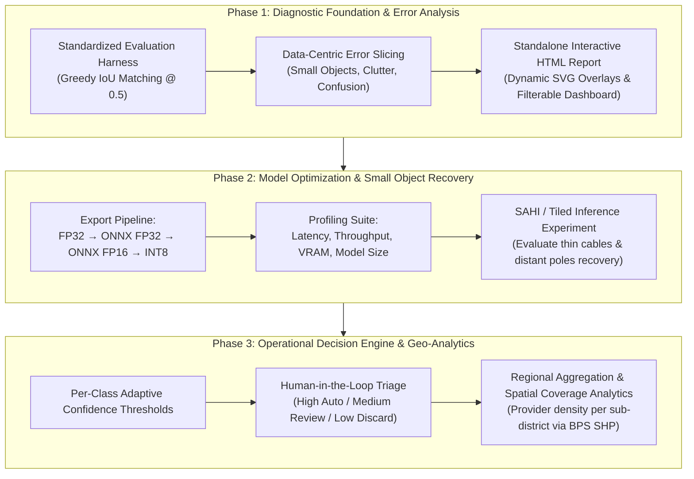

# Master Enhancement Roadmap: Telecom Infrastructure Object Detection

**Document Version:** 1.0.0  
**Status:** Approved Architecture Blueprint  
**Base Model:** YOLOv8 (`deployment/best.pt`, High-Resolution 1248px v2.1)  
**Target Environment:** Local Python 3.10+ / Offline-Ready Diagnostic & Deployment  

---

## 1. Executive Summary & Vision

This project originated as a Machine Learning internship project at Telkomsel (Business Growth & Analytics Division) to visually map telecom provider infrastructure (CBN, Indosat, MyRepublic, Lintasarta, Indihome) from street-level imagery across urban areas in Indonesia.

This roadmap establishes the technical evolution of the repository **without destructive refactoring**. The existing systems, legacy model (`best.pt`), historical dataset lineage, and desktop GIS application remain intact as baseline foundations. This roadmap positions the repository as a **living laboratory** to demonstrate modern ML Engineering capabilities:
1. Rigorous, data-centric evaluation and error analysis.
2. Model optimization and edge inference (quantization and tiled inference).
3. Translating computer vision outputs into operational business intelligence.

---

## 2. Multi-Phase Roadmap Overview

---

## 3. Detailed Phase Breakdown

### Phase 1: Diagnostic Foundation & Error Analysis (Current Target)
* **Primary Objective:** Establish a rigorous, transparent evaluation baseline across the 32 real-world validation images, diagnose failure modes, and assess statistical stability for minority classes (Lintasarta $N=2$, Indosat $N=4$).
* **Deliverables:**
  * Modular evaluation suite under `scripts/evaluation/` (`evaluator.py`, `box_matcher.py`, `slicer.py`, `report_builder.py`, `run_evaluation.py`).
  * Standalone interactive diagnostic dashboard at `reports/baseline_evaluation/index.html` featuring dynamic SVG bounding box overlays.
  * Structured machine-readable artifacts: `reports/baseline_evaluation/metrics.json` and `error_catalog.json`.
  * Unit tests validating matching math and IoU logic under `tests/test_box_matcher.py`.
* **Success Criteria:**
  * Deterministic computation of Precision, Recall, mAP50, and mAP50-95 per class and overall.
  * Categorization of False Negatives on small-scale objects ($Area < 32^2$ px).
  * 100% offline-ready HTML report with zero external CDN or background server dependencies.

---

### Phase 2: Model Optimization & Small Object Inference
* **Primary Objective:** Optimize the production model `best.pt` for desktop/edge deployment and address resolution degradation on thin features (fiber optic cables and distant poles).
* **Components & Experiments:**
  1. **Quantization & Format Export:**
     * Export pipeline: PyTorch FP32 $\to$ ONNX FP32 $\to$ ONNX FP16 $\to$ INT8 (calibrated using train split samples).
  2. **Comparative Profiling Benchmark:**
     * Measure 4-dimensional trade-offs: *Latency (ms/frame)*, *Throughput (FPS)*, *Model Size (MB)*, and *Per-Class mAP Retention*.
     * Assess whether INT8 quantization degrades minority class performance (Lintasarta).
  3. **Tiled Inference (SAHI Integration):**
     * Evaluate slice-based inference (e.g., $640 \times 640$ sliding window with $0.2$ overlap) against standard $1248 \times 1248$ full-image inference.
     * Quantify Recall improvements on thin cables and cluttered scenes.
* **Deliverables:**
  * Model export and calibration script at `scripts/optimization/export_quant.py`.
  * Benchmark runner at `scripts/optimization/profile_models.py`.
  * Patch-based inference utility at `scripts/inference/tiled_infer.py`.

---

### Phase 3: Operational Decision Engine & Geo-Analytics
* **Primary Objective:** Convert raw object detections into business-ready operational analytics and field survey decision workflows.
* **Components & Experiments:**
  1. **Per-Class Adaptive Confidence Thresholds:**
     * Compute optimal confidence cutoffs per provider from validation F1 curves (e.g., higher threshold for dominant CBN $\approx 0.45$, sensitive threshold for Lintasarta $\approx 0.20$).
  2. **Human-in-the-Loop Verification Queue:**
     * Categorize inference results into 3 operational tiers:
       * *High Confidence ($\ge T_{\text{high}}$):* Directly committed to automated business reporting.
       * *Medium Confidence ($T_{\text{low}} \le conf < T_{\text{high}}$):* Routed to analyst manual review queue.
       * *Low Confidence ($< T_{\text{low}}$):* Pruned as noise/clutter.
  3. **Geo-Spatial Business Aggregator:**
     * Link image EXIF GPS metadata with BPS administrative boundary shapefiles (`deployment/map/`).
     * Generate aggregate analytics: provider density per sub-district (*Kecamatan*), competitive share of visual presence, and coverage gap identification.
* **Deliverables:**
  * Post-processing thresholding module at `scripts/analytics/thresholding.py`.
  * Geospatial analytics pipeline integrated with the desktop application in `deployment/`.

---

## 4. Guiding Architectural Principles

1. **Non-Destructive Evolution:** Core project components (`deployment/`, `data/`, `experiments/`) remain untouched. All new modules act as additive, modular layers.
2. **Data-Centric Rigor:** Macro metrics (such as overall mAP) must never be evaluated in isolation without inspecting object scale distributions and small-sample class reliability.
3. **Artifact Portability:** All generated reports and visualizations must function as self-contained static artifacts that can be shared and opened without dedicated backend infrastructure.
4. **Reproducible Experimentation:** Every benchmark figure must trace back to explicit inputs, model checkpoints, and documented dataset splits.
